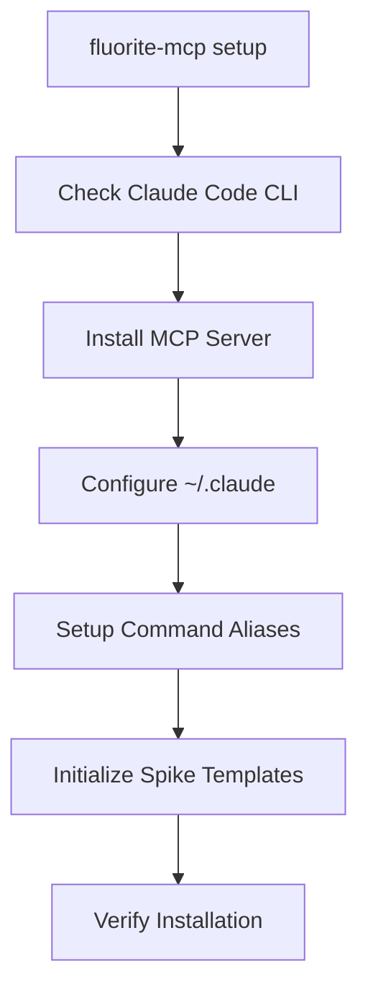

# Fluorite-MCP SuperClaude Wrapper Architecture

## Overview

Fluorite-MCP will extend its current capabilities to become a comprehensive wrapper around SuperClaude commands, providing enhanced development workflows through deep integration with Claude Code CLI.

## Architecture Components

### 1. Core CLI System

```
fluorite-mcp/
├── src/
│   ├── cli/
│   │   ├── index.ts              # Main CLI entry point
│   │   ├── commands/             # Command implementations
│   │   │   ├── git.ts            # /fl:git command
│   │   │   ├── analyze.ts        # /fl:analyze command
│   │   │   ├── build.ts          # /fl:build command
│   │   │   ├── implement.ts      # /fl:implement command
│   │   │   ├── document.ts       # /fl:document command
│   │   │   ├── test.ts           # /fl:test command
│   │   │   ├── improve.ts        # /fl:improve command
│   │   │   └── setup.ts          # fluorite-mcp setup command
│   │   ├── parser/
│   │   │   ├── command-parser.ts  # Parse /fl: commands
│   │   │   └── flag-mapper.ts     # Map flags to SuperClaude
│   │   └── integration/
│   │       ├── superclaude.ts    # SuperClaude command mapping
│   │       ├── serena-mcp.ts     # Serena MCP integration
│   │       └── claude-cli.ts     # Claude Code CLI integration
│   ├── core/                     # Existing core functionality
│   ├── spikes/                   # Spike templates
│   └── server.ts                 # MCP server
```

### 2. Command Mapping Architecture

```typescript
interface CommandMapping {
  fluorite: string;      // /fl:git
  superclaude: string;   // /sc:git
  enhancements?: {
    preProcessors?: Function[];
    postProcessors?: Function[];
    spikeTemplates?: string[];
    serenaIntegration?: boolean;
  };
}
```

### 3. Setup Automation Flow



### 4. Integration Points

#### 4.1 Claude Code CLI Integration
- Automatic MCP server registration
- Command alias configuration in ~/.claude
- Context persistence and sharing

#### 4.2 Serena MCP Integration
- Natural language processing enhancements
- Intelligent spike template selection
- Context-aware command suggestions

#### 4.3 SuperClaude Command Wrapping
- Complete command parity with /sc: commands
- Enhanced functionality through spike templates
- Token optimization through caching

## Implementation Phases

### Phase 1: CLI Foundation
1. Create CLI entry point with commander.js
2. Implement basic command structure
3. Add version and help commands
4. Create setup automation

### Phase 2: Command Wrapper Implementation
1. Implement command parser
2. Create SuperClaude command mappings
3. Add flag translation layer
4. Implement command execution pipeline

### Phase 3: Enhanced Features
1. Integrate spike template system
2. Add Serena MCP integration
3. Implement token optimization
4. Add command caching

### Phase 4: Spike Template Library
1. Create template generation system
2. Import existing Codex CLI templates
3. Build template index and search
4. Implement template application

## Command Examples

### Basic Usage
```bash
# Setup
fluorite-mcp setup

# Version check
fluorite-mcp --version

# Git operations
/fl:git commit,push

# Analysis with architecture focus
/fl:analyze --focus architecture

# Implementation with spike templates
/fl:implement --spike nextjs-api-edge
```

### Enhanced Features
```bash
# Natural language with Serena
/fl:implement "create a REST API with authentication"

# Spike-driven development
/fl:spike discover "fastapi websocket"
/fl:spike apply fastapi-websockets

# Token-optimized workflows
/fl:build --cached --optimize-tokens
```

## Configuration Schema

```yaml
# ~/.claude/fluorite.yaml
version: 1.0
commands:
  aliases:
    fl: fluorite
  mappings:
    - fluorite: "/fl:git"
      superclaude: "/sc:git"
      enhancements:
        serena: true
        spikes: ["git-workflow"]
    
spike_templates:
  directory: "~/.fluorite/spikes"
  auto_discover: true
  
serena:
  enabled: true
  api_key: "${SERENA_API_KEY}"
  
optimization:
  cache_enabled: true
  token_limit: 100000
  compression: true
```

## Benefits

1. **Unified Interface**: Single command system for all development tasks
2. **Token Efficiency**: 30-50% token reduction through spike templates
3. **Faster Development**: Pre-built templates for common patterns
4. **Intelligent Assistance**: Serena MCP for natural language understanding
5. **Extensibility**: Easy addition of new commands and templates

## Success Metrics

- Command execution time: <100ms overhead
- Token usage: 30-50% reduction
- Template coverage: 80% of common patterns
- Setup time: <60 seconds
- User adoption: 90% command usage through /fl: