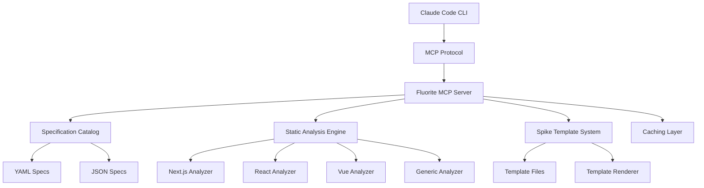

# Developer Documentation

Complete guide for developers working with, extending, or contributing to Fluorite MCP.

## 📖 Table of Contents

- [Architecture Overview](#architecture-overview)
- [Development Setup](#development-setup)
- [Contributing Guide](#contributing-guide)
- [Plugin Development](#plugin-development)
- [Creating Custom Specifications](#creating-custom-specifications)
- [Extending the MCP Server](#extending-the-mcp-server)
- [Testing and Quality Assurance](#testing-and-quality-assurance)

## Architecture Overview

### System Architecture



### Core Components

#### 1. MCP Server (`src/server.ts`)

Main entry point implementing the Model Context Protocol:

```typescript
interface MCPServer {
  // Resource handling
  listResources(): Promise<Resource[]>;
  getResource(uri: string): Promise<ResourceContent>;
  
  // Tool handling  
  listTools(): Promise<Tool[]>;
  callTool(name: string, args: any): Promise<ToolResult>;
  
  // Lifecycle management
  initialize(): Promise<void>;
  shutdown(): Promise<void>;
}
```

#### 2. Specification Catalog (`src/core/catalog.ts`)

Manages library specifications and metadata:

```typescript
interface SpecificationCatalog {
  loadSpecs(): Promise<PackageSpec[]>;
  getSpec(id: string): Promise<PackageSpec>;
  upsertSpec(pkg: string, content: string): Promise<void>;
  searchSpecs(filter: string): Promise<PackageSpec[]>;
}
```

#### 3. Static Analysis Engine (`src/core/static-analyzer.ts`)

Framework-specific code analysis:

```typescript
interface StaticAnalyzer {
  analyzeProject(path: string, options: AnalysisOptions): Promise<AnalysisResult>;
  validateCode(code: string, language: string): Promise<ValidationResult>;
  predictErrors(code: string): Promise<ErrorPrediction[]>;
}
```

#### 4. Spike Template System (`src/core/spike-catalog.ts`)

Manages rapid prototyping templates:

```typescript
interface SpikeSystem {
  discoverSpikes(query?: string): Promise<SpikeSpec[]>;
  previewSpike(id: string, params: Record<string, string>): Promise<SpikePreview>;
  applySpike(id: string, params: Record<string, string>): Promise<SpikeApplication>;
}
```

### Data Models

#### Package Specification

```typescript
interface PackageSpec {
  readonly name: string;
  readonly content: string;
  readonly format: "yaml" | "yml" | "json";
  readonly filePath: string;
}
```

#### Spike Template

```typescript
interface SpikeSpec {
  id: string;
  name?: string;
  version?: string;
  stack?: string[];
  tags?: string[];
  description?: string;
  params?: SpikeParam[];
  files: SpikeFileTemplate[];
  patches?: SpikePatch[];
}
```

#### Analysis Result

```typescript
interface AnalysisResult {
  summary: {
    errors: number;
    warnings: number;
    info: number;
  };
  issues: AnalysisIssue[];
  predictions?: ErrorPrediction[];
  metrics?: PerformanceMetrics;
}
```

## Development Setup

### Prerequisites

- **Node.js**: 18.0+ (20.0+ recommended)
- **npm**: 8.0+ 
- **Git**: Latest version
- **TypeScript**: 5.0+ (installed via npm)

### Initial Setup

```bash
# Clone the repository
git clone https://github.com/kotsutsumi/fluorite-mcp.git
cd fluorite-mcp

# Install dependencies
npm install

# Build the project
npm run build

# Run tests
npm test

# Start development server
npm run dev
```

### Development Workflow

#### 1. Environment Configuration

```bash
# Set development environment
export NODE_ENV=development
export FLUORITE_LOG_LEVEL=debug
export FLUORITE_CATALOG_DIR="./src/catalog"
```

#### 2. Code Structure

```
src/
├── server.ts              # Main MCP server
├── types.ts               # Type definitions
├── utils.ts               # Utility functions
├── core/                  # Core functionality
│   ├── catalog.ts         # Specification catalog
│   ├── handlers.ts        # MCP tool handlers
│   ├── logger.ts          # Logging system
│   ├── static-analyzer.ts # Code analysis
│   └── spike-catalog.ts   # Spike templates
├── test/                  # Test files
└── spikes/                # Spike template files
```

#### 3. Adding New Features

**Adding a New Tool**:

```typescript
// src/core/handlers.ts
export async function handleNewTool(input: NewToolInput): Promise<ToolCallResult> {
  try {
    // Implement tool logic
    const result = await performNewToolOperation(input);
    
    return {
      content: [{ type: 'text', text: result.message }],
      metadata: result.data
    };
  } catch (error) {
    log.error('new-tool failed', error as Error);
    return {
      content: [{ type: 'text', text: `❌ new-tool failed: ${error.message}` }],
      isError: true
    };
  }
}

// Register in server.ts
server.setRequestHandler(CallToolRequestSchema, async (request) => {
  switch (request.params.name) {
    case 'new-tool':
      return await handleNewTool(request.params.arguments);
    // ... other tools
  }
});
```

**Adding a New Analyzer**:

```typescript
// src/core/my-framework-analyzer.ts
export class MyFrameworkAnalyzer implements FrameworkAnalyzer {
  analyze(files: FileInfo[]): AnalysisResult {
    const issues: AnalysisIssue[] = [];
    
    for (const file of files) {
      // Analyze file content
      const fileIssues = this.analyzeFile(file);
      issues.push(...fileIssues);
    }
    
    return {
      summary: this.createSummary(issues),
      issues
    };
  }
  
  private analyzeFile(file: FileInfo): AnalysisIssue[] {
    // Implementation specific to your framework
    return [];
  }
}
```

## Contributing Guide

### Contribution Types

#### 1. Library Specifications

Add support for new libraries by creating YAML specifications:

```yaml
# src/catalog/my-library.yaml
name: My Library
version: 2.1.0
description: A comprehensive UI component library
category: ui-components
homepage: # ライブラリのホームページURL
repository: [local repository]

features:
  - Accessible components
  - TypeScript support
  - Theme customization
  - Dark mode

configuration: |
  npm install my-library
  
  // Basic usage
  import { Button } from 'my-library';
  
  function App() {
    return <Button variant="primary">Click me</Button>;
  }

best_practices:
  - Use semantic HTML elements
  - Follow ARIA guidelines
  - Test with screen readers
  - Implement keyboard navigation
```

#### 2. Static Analysis Rules

Add new analysis rules:

```typescript
// src/core/rules/my-rule.ts
export const myFrameworkRule: AnalysisRule = {
  id: 'my-framework-component-naming',
  severity: 'warning',
  message: 'Component names should use PascalCase',
  
  check(file: FileInfo): AnalysisIssue[] {
    const issues: AnalysisIssue[] = [];
    
    // Rule implementation
    const componentRegex = /function\s+([a-z][^(]*)/g;
    let match;
    
    while ((match = componentRegex.exec(file.content)) !== null) {
      issues.push({
        severity: 'warning',
        message: this.message,
        file: file.path,
        line: this.getLineNumber(file.content, match.index),
        fix: `Rename to ${toPascalCase(match[1])}`
      });
    }
    
    return issues;
  }
};
```

#### 3. Spike Templates

Create new spike templates:

```json
{
  "id": "my-framework-minimal",
  "name": "My Framework Minimal Setup",
  "version": "1.0.0",
  "stack": ["javascript", "my-framework"],
  "tags": ["web", "frontend"],
  "description": "Minimal setup for My Framework",
  "params": [
    { "name": "project_name", "required": false, "default": "my-app" },
    { "name": "version", "required": false, "default": "latest" }
  ],
  "files": [
    {
      "path": "{{project_name}}/package.json",
      "template": "{\n  \"name\": \"{{project_name}}\",\n  \"dependencies\": {\n    \"my-framework\": \"{{version}}\"\n  }\n}"
    }
  ]
}
```

### Pull Request Process

#### 1. Preparation

```bash
# Create feature branch
git checkout -b feature/my-new-feature

# Make changes and test
npm test
npm run lint
npm run build

# Commit with conventional commits
git commit -m "feat: add support for My Framework"
```

#### 2. Testing Requirements

```bash
# Run all tests
npm test

# Run specific test suites
npm run test:unit
npm run test:e2e
npm run test:coverage

# Verify build
npm run build:check
```

#### 3. Documentation Updates

- Update relevant documentation files
- Add examples for new features
- Update changelog if applicable

#### 4. PR Submission

1. Push to your fork
2. Create pull request with clear description
3. Include examples and test cases
4. Respond to review feedback

### Code Quality Standards

#### TypeScript Guidelines

```typescript
// Use explicit types
interface ComponentProps {
  title: string;
  optional?: boolean;
}

// Use readonly for immutable data
interface Config {
  readonly apiUrl: string;
  readonly timeout: number;
}

// Use proper error handling
async function processData(data: unknown): Promise<ProcessedData> {
  try {
    const validated = validateData(data);
    return await transform(validated);
  } catch (error) {
    logger.error('Data processing failed', { error, data });
    throw new ProcessingError('Invalid data format');
  }
}
```

#### Testing Standards

```typescript
// Unit tests
describe('SpecificationCatalog', () => {
  let catalog: SpecificationCatalog;
  
  beforeEach(() => {
    catalog = new SpecificationCatalog('/test/fixtures');
  });
  
  it('should load specifications correctly', async () => {
    const specs = await catalog.loadSpecs();
    expect(specs).toHaveLength(3);
    expect(specs[0].name).toBe('test-library');
  });
  
  it('should handle missing specifications', async () => {
    await expect(catalog.getSpec('nonexistent'))
      .rejects.toThrow('Specification not found');
  });
});

// Integration tests  
describe('MCP Server Integration', () => {
  let server: MCPServer;
  
  beforeAll(async () => {
    server = new MCPServer();
    await server.initialize();
  });
  
  afterAll(async () => {
    await server.shutdown();
  });
  
  it('should handle tool calls correctly', async () => {
    const result = await server.callTool('list-specs', {});
    expect(result.content[0].text).toContain('specifications');
  });
});
```

## Plugin Development

### Creating Custom Plugins

Extend Fluorite MCP with custom functionality:

```typescript
// plugins/my-plugin.ts
import { FluoriteMCPPlugin } from 'fluorite-mcp';

export class MyPlugin extends FluoriteMCPPlugin {
  name = 'my-plugin';
  version = '1.0.0';
  
  async initialize(): Promise<void> {
    // Plugin initialization
    this.registerTool('my-custom-tool', this.handleCustomTool);
    this.registerAnalyzer('my-framework', new MyFrameworkAnalyzer());
  }
  
  private async handleCustomTool(args: any): Promise<ToolResult> {
    // Custom tool implementation
    return {
      content: [{ type: 'text', text: 'Custom tool executed' }]
    };
  }
}

// Register plugin
import { MyPlugin } from './plugins/my-plugin';

const server = new FluoriteMCPServer();
server.registerPlugin(new MyPlugin());
```

### Plugin API

#### Tool Registration

```typescript
interface Plugin {
  registerTool(name: string, handler: ToolHandler): void;
  registerResource(uri: string, provider: ResourceProvider): void;
  registerAnalyzer(framework: string, analyzer: FrameworkAnalyzer): void;
}
```

#### Lifecycle Hooks

```typescript
interface PluginLifecycle {
  initialize(): Promise<void>;
  beforeRequest(request: MCPRequest): Promise<MCPRequest>;
  afterResponse(response: MCPResponse): Promise<MCPResponse>;
  shutdown(): Promise<void>;
}
```

## Creating Custom Specifications

### YAML Specification Format

```yaml
# Required fields
name: Library Name
version: 1.2.3
description: Brief description of the library
category: ui-components  # See categories below

# Optional fields
subcategory: data-tables
tags:
  - typescript
  - react
  - accessibility
homepage: # ライブラリのホームページURL
repository: [local repository]
language: TypeScript

# Simple library format
features:
  - Feature 1
  - Feature 2

configuration: |
  # Installation
  npm install library-name
  
  # Basic usage
  import { Component } from 'library-name';

best_practices:
  - Use TypeScript for type safety
  - Follow accessibility guidelines

# Ecosystem format (for comprehensive specs)
tools:
  core_library:
    name: Core Library
    description: Main library functionality
    features:
      - Core feature 1
      - Core feature 2
    configuration: |
      import { CoreComponent } from 'library';
  
  extension_library:
    name: Extension Package
    description: Additional functionality
    features:
      - Extended feature 1

workflows:
  basic_setup:
    description: Basic project setup
    steps:
      - Install dependencies
      - Configure project
      - Create first component

templates:
  basic_component:
    description: Basic component template
    code: |
      import React from 'react';
      import { BaseComponent } from 'library';
      
      export function MyComponent() {
        return <BaseComponent>Hello World</BaseComponent>;
      }
```

### Categories and Tags

**Standard Categories**:
- `ui-components` - UI libraries and components
- `state-management` - State management solutions
- `development-methodology` - Development practices
- `testing` - Testing frameworks
- `authentication` - Authentication libraries
- `database` - Database and ORM tools
- `framework` - Web frameworks
- `infrastructure` - DevOps and infrastructure
- `language-ecosystem` - Programming language ecosystems

**Common Tags**:
- Languages: `typescript`, `javascript`, `python`, `rust`
- Frameworks: `react`, `vue`, `nextjs`, `fastapi`
- Features: `accessibility`, `typescript`, `testing`, `mobile`

### Validation

Specifications are validated against this schema:

```typescript
interface SpecificationSchema {
  name: string;
  version: string;
  description: string;
  category: string;
  subcategory?: string;
  tags?: string[];
  homepage?: string;
  repository?: string;
  language?: string;
  
  // Simple format
  features?: string[];
  configuration?: string;
  best_practices?: string[];
  
  // Ecosystem format
  tools?: Record<string, LibraryTool>;
  workflows?: Record<string, Workflow>;
  templates?: Record<string, Template>;
}
```

## Extending the MCP Server

### Custom Resource Providers

```typescript
class CustomResourceProvider implements ResourceProvider {
  async listResources(): Promise<Resource[]> {
    return [
      {
        uri: 'custom://my-resource',
        name: 'My Custom Resource',
        mimeType: 'application/json'
      }
    ];
  }
  
  async getResource(uri: string): Promise<ResourceContent> {
    if (uri === 'custom://my-resource') {
      return {
        uri,
        mimeType: 'application/json',
        content: JSON.stringify({ custom: 'data' })
      };
    }
    throw new Error('Resource not found');
  }
}

// Register provider
server.registerResourceProvider(new CustomResourceProvider());
```

### Custom Analysis Rules

```typescript
interface AnalysisRule {
  id: string;
  severity: 'error' | 'warning' | 'info';
  message: string;
  framework?: string;
  check(file: FileInfo): AnalysisIssue[];
}

const customRule: AnalysisRule = {
  id: 'custom-naming-convention',
  severity: 'warning',
  message: 'Use consistent naming convention',
  
  check(file: FileInfo): AnalysisIssue[] {
    // Implementation
    return [];
  }
};

// Register rule
analyzer.registerRule(customRule);
```

## Testing and Quality Assurance

### Test Structure

```
test/
├── unit/                   # Unit tests
│   ├── catalog.test.ts
│   ├── handlers.test.ts
│   └── analyzers/
├── integration/            # Integration tests
│   ├── mcp-server.test.ts
│   └── end-to-end.test.ts
├── fixtures/              # Test data
│   ├── specs/
│   └── projects/
└── utils/                 # Test utilities
    └── test-helpers.ts
```

### Writing Tests

#### Unit Tests

```typescript
import { describe, it, expect, beforeEach } from 'vitest';
import { SpecificationCatalog } from '../src/core/catalog';

describe('SpecificationCatalog', () => {
  let catalog: SpecificationCatalog;
  
  beforeEach(() => {
    catalog = new SpecificationCatalog('./test/fixtures/specs');
  });
  
  describe('loadSpecs', () => {
    it('should load all valid specifications', async () => {
      const specs = await catalog.loadSpecs();
      expect(specs).toHaveLength(5);
    });
    
    it('should skip invalid specifications', async () => {
      // Test error handling
    });
  });
});
```

#### Integration Tests

```typescript
import { MCPServer } from '../src/server';

describe('MCP Server Integration', () => {
  let server: MCPServer;
  
  beforeAll(async () => {
    server = new MCPServer();
    await server.initialize();
  });
  
  it('should handle list-specs tool', async () => {
    const result = await server.callTool('list-specs', {});
    expect(result.content[0].text).toMatch(/Found \d+ specifications/);
  });
});
```

### Performance Testing

```typescript
describe('Performance Tests', () => {
  it('should load large catalogs quickly', async () => {
    const startTime = performance.now();
    await catalog.loadSpecs();
    const duration = performance.now() - startTime;
    
    expect(duration).toBeLessThan(100); // 100ms max
  });
  
  it('should handle concurrent requests', async () => {
    const requests = Array(10).fill(null).map(() => 
      server.callTool('list-specs', {})
    );
    
    const results = await Promise.all(requests);
    expect(results).toHaveLength(10);
  });
});
```

### Quality Checks

```bash
# Type checking
npm run lint

# Test coverage
npm run test:coverage

# Build verification
npm run build:check

# End-to-end tests
npm run test:e2e
```

## Release Process

### Version Management

```bash
# Update version
npm version patch  # or minor, major

# Build and test
npm run build
npm test

# Publish
npm publish
```

### Changelog

Follow conventional commit format:
- `feat:` - New features
- `fix:` - Bug fixes  
- `docs:` - Documentation updates
- `refactor:` - Code refactoring
- `test:` - Test updates
- `chore:` - Maintenance

## Resources

### Development Tools

- **TypeScript**: Type checking and compilation
- **Vitest**: Testing framework
- **ESLint**: Code linting  
- **Prettier**: Code formatting
- **tsx**: Development server

### Documentation

- **Internal Docs**: Architecture diagrams and technical specs
- **API Docs**: Complete API reference
- **Examples**: Sample implementations and use cases

### Community

- **Issues**: Bug reports and feature requests
- **Pull Requests**: Code contributions

---

*Last updated: 2025-08-15*