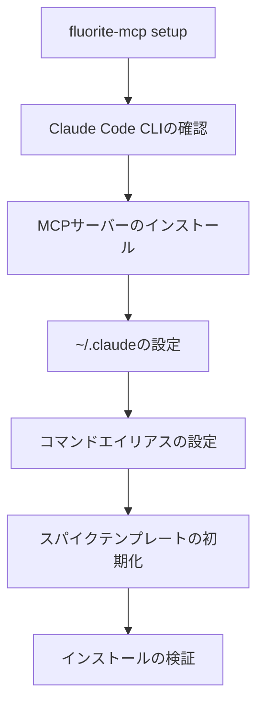

# Fluorite-MCP SuperClaudeラッパーアーキテクチャ

## 概要

Fluorite-MCPは、現在の機能を拡張してSuperClaudeコマンドの包括的なラッパーとなり、Claude Code CLIとの深い統合を通じて強化された開発ワークフローを提供します。

## アーキテクチャコンポーネント

### 1. コアCLIシステム

```
fluorite-mcp/
├── src/
│   ├── cli/
│   │   ├── index.ts              # メインCLIエントリーポイント
│   │   ├── commands/             # コマンド実装
│   │   │   ├── git.ts            # /fl:gitコマンド
│   │   │   ├── analyze.ts        # /fl:analyzeコマンド
│   │   │   ├── build.ts          # /fl:buildコマンド
│   │   │   ├── implement.ts      # /fl:implementコマンド
│   │   │   ├── document.ts       # /fl:documentコマンド
│   │   │   ├── test.ts           # /fl:testコマンド
│   │   │   ├── improve.ts        # /fl:improveコマンド
│   │   │   └── setup.ts          # fluorite-mcp setupコマンド
│   │   ├── parser/
│   │   │   ├── command-parser.ts  # /fl:コマンドの解析
│   │   │   └── flag-mapper.ts     # SuperClaudeへのフラグマッピング
│   │   └── integration/
│   │       ├── superclaude.ts    # SuperClaudeコマンドマッピング
│   │       ├── serena-mcp.ts     # Serena MCP統合
│   │       └── claude-cli.ts     # Claude Code CLI統合
│   ├── core/                     # 既存のコア機能
│   ├── spikes/                   # スパイクテンプレート
│   └── server.ts                 # MCPサーバー
```

### 2. コマンドマッピングアーキテクチャ

```typescript
interface CommandMapping {
  fluorite: string;      // /fl:git
  superclaude: string;   // /sc:git
  enhancements?: {
    preProcessors?: Function[];
    postProcessors?: Function[];
    spikeTemplates?: string[];
    serenaIntegration?: boolean;
  };
}
```

### 3. セットアップ自動化フロー



### 4. 統合ポイント

#### 4.1 Claude Code CLI統合
- 自動MCPサーバー登録
- ~/.claudeでのコマンドエイリアス設定
- コンテキストの永続化と共有

#### 4.2 Serena MCP統合
- 自然言語処理の強化
- インテリジェントなスパイクテンプレート選択
- コンテキスト認識コマンド提案

#### 4.3 SuperClaudeコマンドラッピング
- /sc:コマンドとの完全な互換性
- スパイクテンプレートによる機能強化
- キャッシングによるトークン最適化

## 実装フェーズ

### フェーズ1: CLI基盤
1. commander.jsでCLIエントリーポイントを作成
2. 基本的なコマンド構造を実装
3. バージョンとヘルプコマンドを追加
4. セットアップ自動化を作成

### フェーズ2: コマンドラッパー実装
1. コマンドパーサーを実装
2. SuperClaudeコマンドマッピングを作成
3. フラグ変換レイヤーを追加
4. コマンド実行パイプラインを実装

### フェーズ3: 強化機能
1. スパイクテンプレートシステムを統合
2. Serena MCP統合を追加
3. トークン最適化を実装
4. コマンドキャッシングを追加

### フェーズ4: スパイクテンプレートライブラリ
1. テンプレート生成システムを作成
2. 既存のCodex CLIテンプレートをインポート
3. テンプレートインデックスと検索を構築
4. テンプレート適用を実装

## コマンド例

### 基本的な使用法
```bash
# セットアップ
fluorite-mcp setup

# バージョン確認
fluorite-mcp --version

# Git操作
/fl:git commit,push

# アーキテクチャフォーカスでの分析
/fl:analyze --focus architecture

# スパイクテンプレートを使用した実装
/fl:implement --spike nextjs-api-edge
```

### 強化機能
```bash
# Serenaを使用した自然言語
/fl:implement "認証付きのREST APIを作成"

# スパイク駆動開発
/fl:spike discover "fastapi websocket"
/fl:spike apply fastapi-websockets

# トークン最適化ワークフロー
/fl:build --cached --optimize-tokens
```

## 設定スキーマ

```yaml
# ~/.claude/fluorite.yaml
version: 1.0
commands:
  aliases:
    fl: fluorite
  mappings:
    - fluorite: "/fl:git"
      superclaude: "/sc:git"
      enhancements:
        serena: true
        spikes: ["git-workflow"]
    
spike_templates:
  directory: "~/.fluorite/spikes"
  auto_discover: true
  
serena:
  enabled: true
  api_key: "${SERENA_API_KEY}"
  
optimization:
  cache_enabled: true
  token_limit: 100000
  compression: true
```

## 利点

1. **統一インターフェース**: すべての開発タスクのための単一コマンドシステム
2. **トークン効率**: スパイクテンプレートによる30-50%のトークン削減
3. **高速開発**: 一般的なパターンのための事前構築済みテンプレート
4. **インテリジェント支援**: 自然言語理解のためのSerena MCP
5. **拡張性**: 新しいコマンドとテンプレートの簡単な追加

## 成功指標

- コマンド実行時間: <100msのオーバーヘッド
- トークン使用量: 30-50%削減
- テンプレートカバレッジ: 一般的なパターンの80%
- セットアップ時間: <60秒
- ユーザー採用率: /fl:を通じたコマンド使用の90%